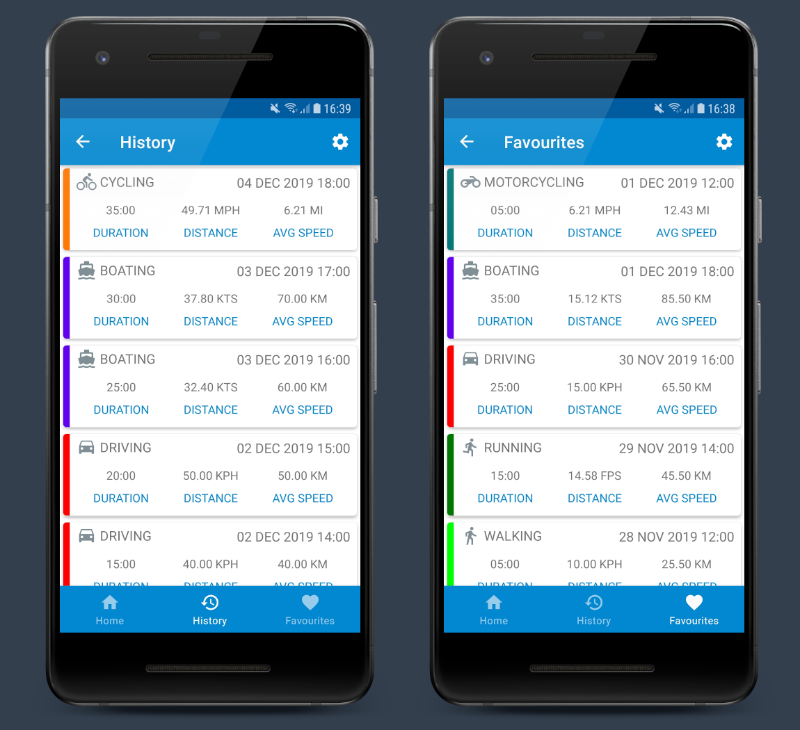
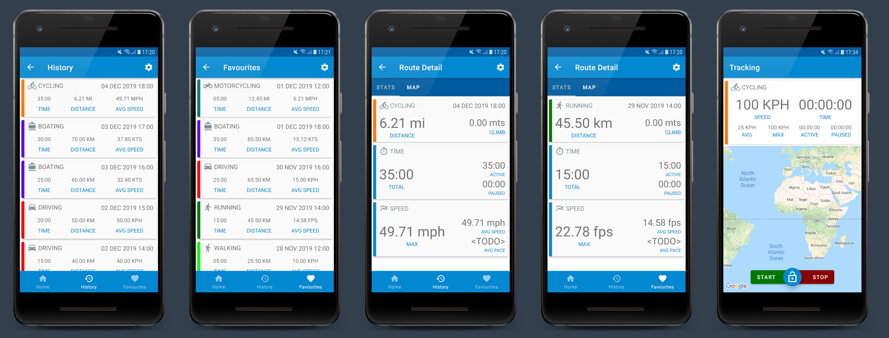

# Road Trip Tracker
Road Trip Tracker is a simple Android application for tracking and logging road trips and travel routes.

The application was originally written while learning the Kotlin programming language for Android.
I have decided to do a complete re-write using modern Android development techniques, components and architecture and since it's that time of the year again, why
not do it as my [Level1Techs](https://level1techs.com/) #Devember2k19 project?

My devblog, ramblings and rants for this years festivities can be found [here](https://forum.level1techs.com/t/devember-road-trip-tracker-android-application/150676/3)

The finished application will use/demonstrate the MVVM architecture and the following components/libraries: -

- [X] Android Room Database
- [X] Android Architecture Components
- [X] Android View Models
- [X] Navigation Library
- [X] View Binding
- [X] LiveData
- [X] Paging Library
- [X] Lifecycle Components
- [X] Google Location Services
- [X] Google Maps

## Screenshots
The UI and design work is still on going but this is how it looks so far.

### History and Favourites

### Application Theme

