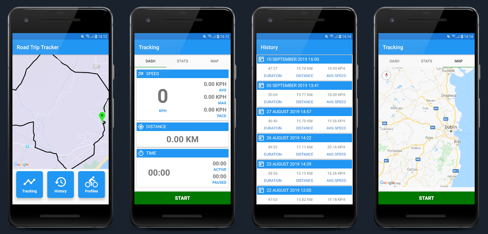

# Road Trip Tracker
Road Trip Tracker is a simple Android application for tracking and logging road trips and travel routes.

The application was originally written while learning the Kotlin programming language for Android.
I have decided to do a complete re-write using modern Android development techniques, components and architecture and since it's that time of the year again, why
not do it as my [Level1Techs](https://level1techs.com/) #Devember2k19 project?

My devblog, ramblings and rants for this years festivities can be found [here](https://forum.level1techs.com/t/devember-road-trip-tracker-android-application/150676/3)

The finished application will use the MVVM architecture and the following components/libraries: -

- Android Room Database
- Android Architecture Components
- Navigation Library
- LiveData
- Paging Library
- Lifecycle Components
- Google Location Services
- Google Maps

## Screenshots

### Current Application
TODO: Add screenshots of a hopefully more modern looking material style application

### Original Prototype
Yep ... I know, it looks horrible ... but that will be fixed.

